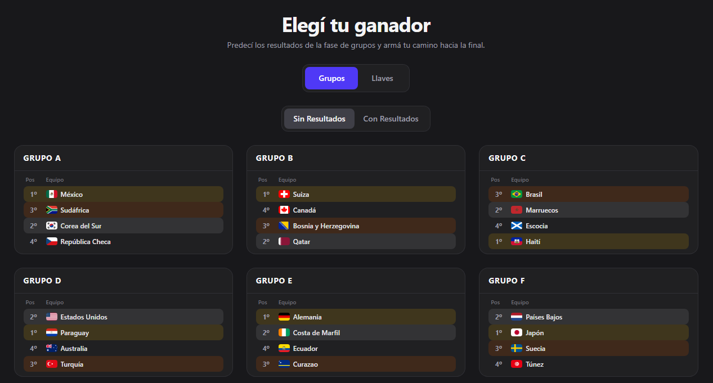

# 🏆 World Cup Simulator 2026 - Frontend

Frontend application built with React for a FIFA World Cup 2026 prediction and simulation platform.

---

## 🧠 Overview

This application allows users to:

- View live match ticker and group standings
- Manually predict match outcomes and build tournament brackets
- Run automatic tournament simulations with simple or adaptive algorithms
- Navigate the complete knockout stage bracket (Round of 16 to Final)
- Select best third-place teams for knockout qualification

---

## 🚀 Tech Stack


| Category | Technology | Version |
|----------|------------|---------|
| **Core Framework** | React | 19.2.6 |
| **Language** | TypeScript | ~6.0.2 |
| **Build Tool** | Vite | 8.0.12 |
| **Runtime** | Bun | (latest) |
| **Styling** | Tailwind CSS | 4.3.0 |
| **Compiler** | React Compiler (Babel) | 1.0.0 |
| **Router** | React Router DOM | 7.17.0 |
| **HTTP Client** | Axios | 1.17.0 |
| **Linting** | ESLint + typescript-eslint | 10.3.0 / 8.59.2 |

---

## ⚡ Requirements

Make sure you have Bun installed:

[https://bun.sh](https://bun.sh)

Check installation:

```bash
bun --version
```

## 📦 Installation

> ⚠️ This project is configured to run with Bun. Using npm or other package managers may not work as expected.

```bash
git clone https://github.com/yourusername/world-cup-simulator-frontend
cd frontend
bun install
bun run dev
```

---

## 🔌 Environment Variables

Create a `.env` file based on `.env.example`:

```bash
cp .env.example .env
```

```env
VITE_API_BASE_URL=https://localhost:5000
```

All Vite environment variables must be prefixed with `VITE_`.

---

## 🔗 Backend Integration

The frontend connects to a .NET 9 backend with PostgreSQL database.

**Backend Repository:** [https://github.com/World-Cup-Simulator/backend](https://github.com/World-Cup-Simulator/backend)

The backend provides REST API endpoints for:
- World Cup teams and groups data
- Match fixtures and results
- Tournament finals bracket
- Simulation algorithms (simple and adaptive modes)

---

## 📁 Project Structure

```
src/
├── app/                    # Global configuration, providers, and routing
│   ├── layout/             # Base page structures (BaseLayout, navigation)
│   ├── routes/             # Application route definitions
│   └── pages/              # View/screen components (HomePage, PredictPage, SimulationPage)
├── assets/                 # Global static assets (images, icons)
├── features/               # Independent business modules (verticals)
│   ├── home/               # Home feature, groups carousel
│   │   ├── components/     # GroupCarousel, GroupCard, MatchRow
│   │   ├── models/         # Tournament types
│   │   └── utils/          # Tournament mapper utilities
│   ├── prediction/         # Prediction feature - manual bracket building
│   │   ├── components/     # GroupPredictor, TournamentBracket, ThirdPlacesModal
│   │   ├── hooks/          # usePredictor
│   │   ├── models/         # Prediction, bracket, and standing types
│   │   └── utils/          # Bracket and standings utilities
│   └── simulation/         # Simulation feature - automatic tournament sim
│       ├── components/     # SimulationGroupView, SimulationBracket, MatchCard
│       ├── hooks/          # useSimulator
│       ├── models/         # Simulation types
│       └── utils/          # Simulation utilities and mappers
├── shared/                 # Reusable code across any feature
│   ├── components/         # Generic UI (FlagImage, ChampionBanner, LoadingOverlay, TickerTape)
│   ├── hooks/              # Global custom hooks
│   ├── models/             # Shared TypeScript types (match, team, ticker types)
│   ├── services/           # Axios client configuration
│   └── utils/              # Pure utility functions
├── App.tsx                 # Root component with global providers
└── main.tsx                # React initialization
```

---

## ⚙️ Features

### 🏠 Home
- Live match ticker with real-time updates
- Interactive groups carousel with grid/list view toggle
- Quick navigation to prediction and simulation modes

### 🎯 Prediction Mode
- Manual match result entry for all group stage matches
- Automatic standings calculation based on results
- Third-place team selector for knockout qualification
- Interactive knockout bracket builder (Round of 16 → Final)
- Reset functionality to start over

### 🎲 Simulation Mode
- **Simple Mode**: Simulate all games without recalculating the ratings
- **Adaptive Mode**: Simulates all the games by recalculating the ratings at each stage
- Toggle between using scores or winner only simulation
- Complete bracket generation with match-by-match progression

---

## 📸 Screenshots

### 🏠 Homepage

Live match ticker and interactive groups carousel.


### 🎯 Prediction Interface

Manual match entry with bracket builder.



### 🎲 Simulation Results

Automatic tournament simulation with full bracket view.


---

## 🌐 Live Demo

Try the application live at:

**[https://wcs.goro-dev.site](https://wcs.goro-dev.site)**

---

## 🚀 Project Status

🟡 In Progress - Active development with regular updates

---
